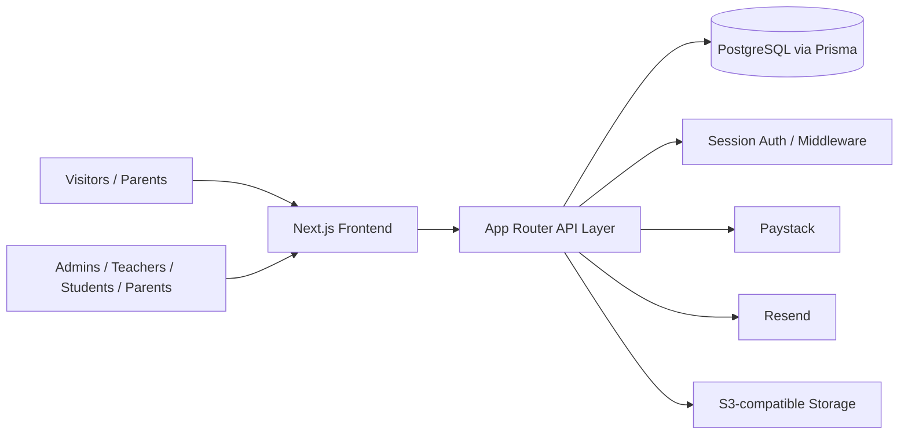

# Frontend Development Document

## Executive Summary for Stakeholders

Ykay College EduPortal has evolved from a simple school website into a functional digital education platform. It now supports public discovery, admissions, role-based school portals, student and parent engagement, and an IT education experience.

### What is already in place
- a polished public website for school information and admissions,
- a real admissions journey with submission and status tracking,
- role-based access for admin, teacher, student, parent, and IT learner users,
- live dashboard-driven modules for school operations,
- and an expanding exam and IT-learning surface.

### Why this matters
The platform creates value across the entire school lifecycle: parents can begin admission online, staff can work from role-specific dashboards, students and parents can monitor academic progress, and the school gains a foundation for digital operations and future growth.

### Simple architecture view

### Main priorities for the next phase
1. complete the admissions review and onboarding handoff,
2. harden finance, reporting, and notification workflows,
3. finish the CBT and IT-learning experience,
4. improve reliability, monitoring, and deployment readiness.

---

## 1. Product Positioning

The frontend is now a full digital education platform rather than a brochure-style school website. It serves four primary audiences:

- prospective parents and students,
- school administrators and staff,
- enrolled students and parents,
- and learners using the IT education and CBT experience.

The product is organized around four major experience pillars:

- a polished public website,
- role-based school portals,
- an IT education academy,
- and a growing exam-preparation and CBT surface.

The current frontend is visually strong and already includes many live routes and interactive flows. It is no longer only a presentation layer; it now supports real sign-in, role-aware navigation, dashboard data loading, and portal-specific modules.

---

## 2. Current Frontend Surface

### A. Public Experience
The public experience is implemented through routes such as:

- / for the homepage
- /about for school story and values
- /academics for academic programmes
- /admissions for application entry
- /admissions/status for status lookup
- /campus-life for facilities and student life
- /news-events and /news-events/[slug] for school updates
- /contact and /faq for support and information
- /portal for portal selection
- /login, /reset-password, /signup, /privacy-policy

These pages are built with a reusable header, footer, and themed visual system that is consistent across the public site.

### B. Admissions Experience
The admissions flow is one of the most complete user-facing journeys in the frontend.

It includes:

- a multi-step admissions form,
- document upload UI,
- payment and review steps,
- and status-checking after submission.

The implementation is connected to real backend APIs for draft creation, upload URL handling, payment start, payment verification, and submission.

### C. Portal Experience
The portal surface is implemented through role-specific entry points and dashboards:

- /admin and /admin-admissions
- /teacher/dashboard and teacher sub-pages
- /student/dashboard and student sub-pages
- /parent/dashboard and parent sub-pages
- /super-admin for school and platform oversight
- /it-portal/auth and /it-portal/dashboard for IT learning

The frontend uses role-aware navigation and protected route handling to steer users to the right experience after authentication.

### D. Module-Specific Pages
The product includes a broad set of portal pages for daily school operations:

- teacher attendance, gradebook, reports, question bank, evaluations, CBT center, class roster, and performance pages,
- student attendance, report cards, exams, timetable, profile, announcements, and WAEC practice pages,
- parent fees, attendance, report cards, messages, and events pages,
- admin admissions, students, staff, fees, finance, reports, class manager, budgets, expenses, and notifications pages,
- super-admin schools, portals, broadcasts, health, and system oversight pages.

---

## 3. What Is Implemented Well

### Strong visual foundation
The UI is modern, branded, and presentation-ready. The school identity is visible throughout the site and the portal experience.

### Real role-based structure
The app now has a clear distinction between public pages, admissions flow, and the student/teacher/parent/admin portal surfaces.

### Live data-backed dashboards
Admin, teacher, student, and parent dashboards are not purely static. They fetch data from backend endpoints for metrics, activity, reports, attendance, and fees.

### Strong IT education presentation
The IT education hub is a clear product pillar and includes a dedicated portal entry point for learners.

### Secure entry flow
The login and route-protection experience is built around real authentication and session handling rather than a mock-only experience.

---

## 4. Frontend Maturity Assessment

### Mature areas
- public website structure,
- admissions experience,
- portal shell and dashboard layout,
- authentication and route redirection,
- IT education entry experience.

### Still maturing
- onboarding and school setup experience,
- fully polished exam/CBT experience,
- deeper empty-state and error-state handling,
- accessibility across all portal screens,
- consistent data-loading behavior across modules.

---

## 5. User Experience Priorities

### Priority 1 — Finish the core experience
The main public and portal entry points should feel complete and consistent. Navigation should be obvious and the CTA flow should be clear from home to admissions to login.

### Priority 2 — Make each portal feel distinct
Admin, teacher, student, and parent experiences should each feel tailored to the user’s task rather than looking like generic dashboards.

### Priority 3 — Connect more UI to live data
More forms and modules should show real state, handle empty data gracefully, and surface actionable errors.

### Priority 4 — Improve product-specific depth
The IT education and CBT areas should feel more like full learning products and less like catalog or shell experiences.

### Priority 5 — Harden production readiness
The frontend should continue improving accessibility, responsive behavior, loading states, error recovery, and consistency across modules.

---

## 6. Recommended Frontend Roadmap

### Near term
- complete onboarding and school-setup UI,
- unify loading and empty-state patterns,
- improve portal navigation clarity,
- strengthen role-specific CTA flows.

### Medium term
- connect remaining modules to live APIs,
- improve exam and result presentation,
- deliver a fuller IT portal learning experience.

### Longer term
- add stronger analytics surfaces,
- polish welfare and communication features,
- move the whole experience toward a production-grade school operating platform.

---

## 7. Frontend Summary

The frontend already demonstrates a credible digital school platform. The biggest opportunity is to move from attractive and structurally complete pages to a fully coherent, data-driven, and role-aware product experience that feels complete from first visit to daily school operations.
